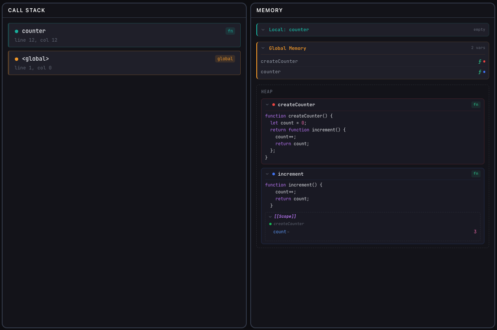
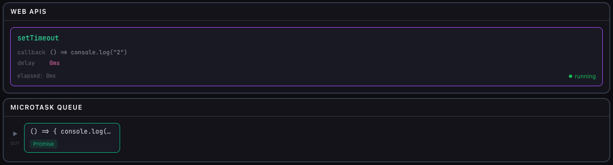
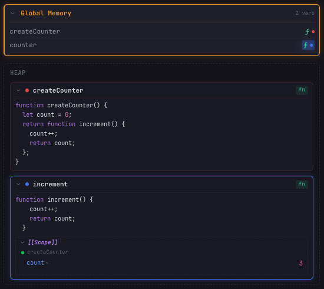

# JavaScript Visualized

> An interactive educational tool that visualizes JavaScript execution step-by-step — including Call Stack, Memory (local, global, heap), Event Loop, Task Queue, Microtask Queue, and Promises.


## ✨ What makes this different?

Unlike other JS visualizers, this tool shows **how memory actually works**:

- **Global Memory** — see variables stored as primitives, `ⓕ` for functions, `[Pointer]` for objects
- **Local Memory** — appears when a function is called, disappears when it returns, color-matched to its Call Stack frame
- **Heap** — objects, arrays, and functions live here. Pointers use matching colors so you can trace references instantly
- **`[[Scope]]` (Closures)** — see captured variables surviving beyond their original scope
- **Promise Internals** — `[[PromiseState]]`, `[[PromiseResult]]`, `[[PromiseFulfillReactions]]` visible in the Heap
- **Async Suspension** — watch async functions dim when suspended at `await`, with their local memory persisting

## 🚀 Try it

**Live:** [https://javascript-visualized.vercel.app](https://javascript-visualized.vercel.app)

Or run locally:

```bash
git clone https://github.com/kleysonmorais/javascript-visualized.git
cd javascript-visualized
npm install
npm run dev
```

## 📸 Screenshots

### Synchronous Execution — Function Call with Memory


### Async — Promise vs setTimeout (Microtask Priority)


### Closures — [[Scope]] Surviving Beyond Its Frame


## 🎯 Features

### Visualization Panels
- **Code Editor** — Monaco Editor with syntax highlighting and line-by-line execution tracking
- **Call Stack** — color-coded frames that match their memory blocks
- **Memory** — local and global memory with primitives, `ⓕ` functions, `[Pointer]` references
- **Heap** — objects, arrays, functions, Promise internals, closure `[[Scope]]`
- **Web APIs** — active timers and fetch requests with progress bars
- **Task Queue** — macrotask callbacks (setTimeout, setInterval)
- **Microtask Queue** — Promise callbacks with priority visualization
- **Event Loop** — phase-aware indicator showing the current execution phase
- **Console** — virtual console output matching execution steps

### Supported JS Features
- Variables (`var`, `let`, `const`), assignments, operators
- Functions (declarations, expressions, arrow functions)
- Control flow (`if/else`, `for`, `while`, `break`, `continue`)
- Objects, arrays, property access, mutation
- `setTimeout`, `setInterval`, `clearTimeout`, `clearInterval`
- Promises (`.then`, `.catch`, `.finally`, chaining, `Promise.all`, `Promise.race`)
- `async`/`await` with suspension/resumption visualization
- `fetch()` simulation with mock responses
- Classes (`constructor`, methods, `extends`, `super()`, `static`)
- Generators (`function*`, `yield`, `for...of`)
- Closures with `[[Scope]]` visualization
- Destructuring (object, array, nested, rest/spread)
- Template literals
- `try`/`catch`/`finally`

### UX
- Step-by-step navigation (back/forward/play/pause)
- Adjustable playback speed (0.5x — 3x)
- Keyboard shortcuts (Arrow keys, Space, Home/End)
- 8 pre-configured code examples
- Hover interactions linking pointers to heap objects
- Framer Motion animations
- Responsive design (desktop + mobile)
- Dark theme with neon accents

## 🏗️ Architecture

See [ARCHITECTURE.md](./docs/ARCHITECTURE.md) for a detailed overview.

**Quick summary:**

```
Source Code (string)
       │
       ▼
   acorn.parse() → AST (ESTree)
       │
       ▼
   Interpreter (custom walker)
       │
       ├→ CallStack frames (with colors)
       ├→ MemoryBlocks (local/global, linked to frames)
       ├→ HeapObjects (shared, color-matched to pointers)
       ├→ WebAPI entries, Queue items
       └→ ConsoleEntries
       │
       ▼
   ExecutionStep[] → array of complete snapshots
       │
       ▼
   Step Navigator (back/next) → renders current snapshot
```

## 🛠️ Tech Stack

| Technology | Purpose |
|-----------|---------|
| **Vite** | Build tool and dev server |
| **React** | UI framework |
| **TypeScript** | Type safety |
| **TailwindCSS** | Styling |
| **Zustand** | State management |
| **acorn** | JavaScript parser (AST generation) |
| **Monaco Editor** | Code editor (same as VS Code) |
| **Framer Motion** | Animations |
| **Vitest** | Testing |

## 🤝 Contributing

See [CONTRIBUTING.md](./CONTRIBUTING.md) for setup instructions and guidelines.

## 📄 License

MIT

